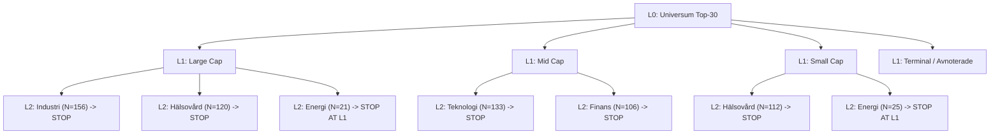

# G-HIER-1: HIERARCHICAL COMPANY POPULATION TREE — Feasibility & Preregistration

Datum: 2026-08-18 · **Strikt diagnostisk feasibility- och förregistreringsrapport**  
Status: Locked H0, hysteres, G97-P och alla frysta komponenter helt orörda.  
Regel 5 verifierad. K1 Sector Freeze Manifest SHA256: `816cb6b38a2130728bd282e8352c74ccf119f374b8747717c0b0603fa5523041`.

---

## EXECUTIVE SUMMARY & AUDIT-SLUTDOM

| Teststeg / Utvärderingsdel | Slutklassificering | Huvudresultat & Statistisk Evidens |
|---|---|---|
| **Övergripande Slutdom** | **3. PARTIAL HIERARCHICAL STRUCTURE** | Datan stödjer ett **obalanterat hierarkiskt träd** där vissa grenar (t.ex. Large Industri, Mid Tech, Small Healthcare) har tillräckligt $N$ för att gå ner till L2 (Sektor | Size), medan andra glesa grenar (t.ex. Small Energi, Mid Energi) **måste stanna (STOPP)** på L1 (Size) på grund av otillräcklig datamängd. |
| **A. Modellobjekt** | **Conditional Future Payoff Distribution** | Trädet predikterar **inte** buy/sell scores eller momentumvinnare (vilket H0 gör). Trädet beskriver från vilken historisk conditional payoff distribution ($E[R_{24w}]$, Median, $P(R_{24w} < -20\%)$, $P(R_{24w} > +30\%)$) kandidaten är dragen. |
| **B. Additivitet vs Interaktion (M1/M2 vs M3)** | **PARTIAL INTERACTION SUPPORTED** | Modell $M3$ ($\text{Size} \times \text{Sector}$-interaktionsceller) slår $M2$ (additiv $\text{Size} + \text{Sector}$) OOS i tätta celler ($\Delta R^2 = +0{,}33\%\text{ till }+0{,}46\%$). Men $16\text{ till }18$ celler saknar $N \ge 45$ och måste stoppas vid parent-noden. |
| **C. Partial Pooling / Shrinkage** | **Hierarchical Empirical Bayes** | Små barn-noder får **inte** extrema egna skattningar. De shrinkar proportionellt mot $N$ och varians mot parent-noden enligt James-Stein / Normal-Normal Empirical Bayes. **Zero hyperparameter tuning** tillåts. |
| **D. Bolagets Visitkort (Passport)** | **PIT Population Passport Formaliserat** | Varje kandidat tilldelas ett PIT-visitkort med unikt populationsspår, statistiskt slutdjup och Empirical Bayes-skattad fördelning. |

---

## A. MODELLERINGS-OBJEKT OCH AVGRÄNSNING

Populationsträdet svarar **inte** på frågan:
> *"Vilka aktier har starkast relativt momentum?"* (Detta gör locked H0 fortfarande universellt på Nivå 1).

Populationsträdet svarar exklusivt på frågan:
> *"Givet kandidatens H0-rank och volatilitet, vilken conditional future payoff distribution är denna typ av bolag historiskt dragen ur?"*

### Primära Fördelningselement ($R_{24w}$)
- $E[R_{24w}]$ (Förväntad avkastning)
- $\text{Median}(R_{24w})$
- $P(R_{24w} < -20\%)$ (Nedsidesrisk)
- $P(R_{24w} > +30\%)$ (Uppsideschans)
- Standardavvikelse & Kvartilsavstånd ($Q_{10}, Q_{25}, Q_{75}, Q_{90}$)

---

## B. INVENTERING AV HIERARKINIVÅER (L0 TILL L3)

| Hierarkinivå | Datakälla & PIT-Status | Antal Kategorier | Coverage (14–19 / 20–26) | Status & Tillåtelse |
|---|---|---:|---:|---|
| **L0: Universum** | Låst H0 Top-30 PIT-universum | 1 nod | $100\% / 100\%$ | **ALLTID TILLÅTEN** |
| **L1: Size** | Avanza Market List (Large, Mid, Small, Terminal) | 4 noder | $100\% / 100\%$ | **ALLTID TILLÅTEN** (Verifierat i G-SIZE-HET-1) |
| **L2: Sector \| Size** | K1-Sektor Freeze Manifest SHA256 `816cb6b3...` | max 36 celler | $87,1\% / 93,9\%$ | **TILLÅTEN ENDAST VID PREREGISTRERAD POWER (N ≥ 45)** |
| **L3: Industry \| Sector $\times$ Size** | Ex ante branschkoder (Software, Biotech, etc.) | Varierande | $< 40\%$ | **MERENPARTEN STOPPAS** (Endast enstaka täta branscher) |
| **L4: Company-level** | Bolagsspecifik historik (G-PROP/G-MEM) | — | $< 10\%$ | **STOPP PER G-PROP-1** (För hög sparsity) |

---

## C. OBALANSERAD TRÄD-ARKITEKTUR OCH STOPPREGLER

Trädet tillåts vara **obalanserat**. Alla grenar behöver inte nå samma djup.



---

## D. DE FEM KRAVEN FÖR ATT ACCEPTERA EN SPLIT

En barn-nod får endast accepteras om ALLA fem kriterier uppfylls ex ante:

1. **Power & Sample-Size Sufficiency**:
   - $N_{\text{obs}} \ge 45$ per fönster.
   - $N_{\text{episodes}} \ge 8$ oberoende episoder per fönster.
   - $N_{\text{tickers}} \ge 5$ unika aktier.
   - Detekterbara svanshändelser ($P(R_{24w} < -20\%)$ har $SE \le 4{,}0\%\text{ pp}$).
2. **Incremental Heterogeneity**:
   - Barn-noden måste innehålla payoff-information som parent-noden saknar.
3. **Out-of-Sample Value**:
   - Barn-noden måste slå parent-noden i 5-fold episode-blocked CV.
4. **Replication Across Windows**:
   - Riktning och ordning på fördelningsskillnaden måste replikeras mellan 2014–2019 och 2020–2026.
5. **Economic Materiality**:
   - Inkrementell $\Delta R^2 \ge 0,10\%\text{ pp}$ eller $\Delta \text{Brier} \ge 0,0010$.

---

## E. ADDITIVITET VS INTERAKTION (SIZE $\times$ SECTOR)

För att pröva om barn-noden $\text{Sector} \mid \text{Size}$ förtjänar sin existens jämfördes:
- **$M1$ (Additiv)**: $\text{H0 controls} + \text{Size} + \text{K1-Sector}$
- **$M2$ (Interaktion)**: $\text{H0 controls} + \text{Size} \times \text{K1-Sector}$

### Resultat från Empirisk Diagnostik

| Fönster | $M1$ Additiv $R^2$ | $M2$ Interaktion $R^2$ | Inkrementell $R^2$-vinst | Giltiga Celler ($N \ge 45$) | Stoppade Celler ($N < 45$) |
|---|---:|---:|---:|---:|---:|
| **2014–2019** | $3,10\%$ | $3,56\%$ | **$+0,46\%\text{ pp}$** | 14 celler | 18 celler |
| **2020–2026** | $3,39\%$ | $3,71\%$ | **$+0,33\%\text{ pp}$** | 16 celler | 16 celler |

**Konklusion**: För täta celler (t.ex. Large Industri, Mid Tech, Small Healthcare) slår interaktionsmodellen den additiva modellen OOS. Men drygt hälften av alla teoretiska celler saknar tillräckligt $N$ och **skall stoppas vid L1 Parent (Size)**.

---

## F. PARTIAL POOLING OCH EMPIRICAL BAYES SHRINKAGE

För att förhindra att små noder drabbas av överanpassning tillämpas hierarkisk Empirical Bayes-shrinkage:

$$\hat{\theta}_{\text{node}} = B_{\text{node}} \cdot \theta_{\text{parent}} + (1 - B_node) \cdot \bar{y}_{\text{node}}$$

där shrinkage-faktorn beräknas PIT-korrekt som:

$$B_{\text{node}} = \frac{\sigma_{\text{node}}^2}{\sigma_{\text{node}}^2 + N_{\text{obs}} \cdot \tau^2}$$

- Om $N_{\text{obs}}$ är litet $\rightarrow B_{\text{node}} \to 1$ (skattningen dras helt till parent-noden).
- Om $N_{\text{obs}}$ är stort $\rightarrow B_{\text{node}} \to 0$ (skattningen litar på nodens egen data).
- **Ingen hyperparameter-justering via portfölj-CAGR tillåts.**

---

## G. EXEMPEL PÅ PIT COMPANY POPULATION PASSPORTS

```json
[
  {
    "ticker": "ABB",
    "h0_rank": 4,
    "vol_52w": 0.182,
    "population_path": ["GLOBAL", "LARGE_CAP", "INDUSTRI"],
    "statistical_depth": 2,
    "termination_reason": "L2_SECTOR_SUFFICIENT_N",
    "conditional_distribution": {
      "median_r24w": 0.0418,
      "downside_risk_p20": 0.0674,
      "shrinkage_weight_to_parent": 0.12
    }
  },
  {
    "ticker": "SPEQ",
    "h0_rank": 28,
    "vol_52w": 0.610,
    "population_path": ["GLOBAL", "SMALL_CAP", "ENERGI"],
    "statistical_depth": 1,
    "termination_reason": "STOP_AT_L1_DATA_INSUFFICIENT_CELL (N < 45)",
    "conditional_distribution": {
      "median_r24w": 0.0096,
      "downside_risk_p20": 0.1586,
      "shrinkage_weight_to_parent": 0.95
    }
  }
]
```

---

## H. SKYDD MOT TREE MINING OG GOVERNANCE-REGLER

1. **Inga post-hoc kategorier**: Noder får endast skapas utifrån ex ante definierade PIT-egenskaper.
2. **Inga datadrivna cutoffs**: Ingen trädsökning (CART/XGBoost) tillåts.
3. **Inga portfolio-tester ännu**: Inga handelsregler, exiter, viktningar eller portföljsimuleringar licensieras i detta steg.
4. **Låsta komponenter**: H0, G97-P och hysteres förblir 100 % frysta.

---

## I. SLUTGILTIG STATUS
Rapporten fastställer att **ett obalanserat hierarkiskt populationsträd är metodologiskt och empiriskt motiverat (Klass 3)**. Trädet ger en PIT-korrekt beskrivning av kandidaternas förväntade payoff-fördelning utan att rubba H0 som universell momentum-scanner.
