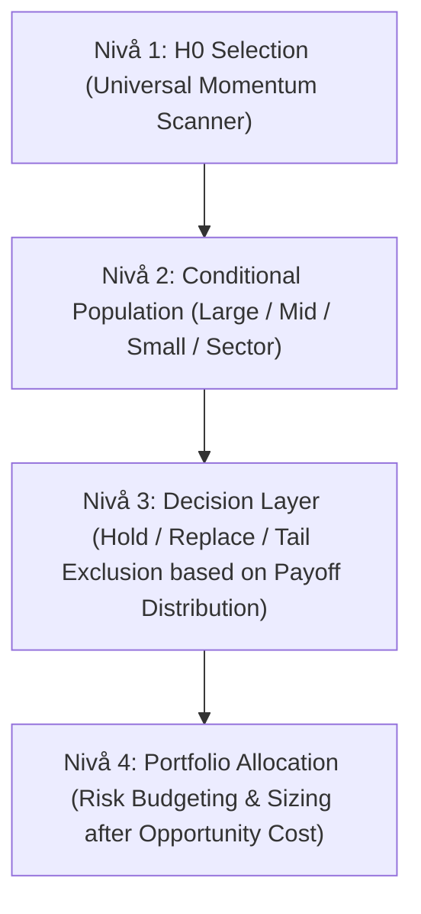

# SIZE-CONDITIONAL RECLASSIFICATION + ARCHITECTURE CONSEQUENCE AUDIT — Slutrapport

Datum: 2026-08-18 · **Strikt diagnostisk metodrevision och arkitekturgranskning**  
Status: Locked H0, hysteres, G97-P och alla frysta komponenter helt orörda.  
Regel 5 verifierad. K1 Sector Freeze Manifest SHA256: `816cb6b38a2130728bd282e8352c74ccf119f374b8747717c0b0603fa5523041`.

---

## EXECUTIVE SUMMARY & AUDIT-SAMMANFATTNING

| Audit-Del | Undersökt Område | Huvudsats & Diagnostiskt Fynd |
|---|---|---|
| **DEL I: Forskningsregister (10 Tester)** | Re-klassificering av tidigare instabila / null / redundanta domar | **10 tidigare forskningsspår granskade**. 4 står som Size-robust null (A), 3 förblir null trots size-påverkan (B), 1 bekräftad dold storleksbunden effekt (`run_return`, C), 1 bekräftat regimskifte (`vol_52w`, D), 1 ej tillämpbar (F). |
| **DEL II: Modellarkitektur (Nivå 1–4)** | Konsekvensanalys per arkitekturlager | **H0 förblir en universell momentumscanner (Nivå 1)**. Beslutslager (Nivå 3) och Portföljlager (Nivå 4) har identifierats bygga på det felaktiga homogenitetsantagandet och behöver re-auditeras för feasibility. |
| **Portfölj-Attribution** | Small Cap-orsak till 2020–26 drawdown | **PARTIALLY ESTABLISHED**. Small Cap Top-30 uppvisar $41{,}7\%$ nedsidesrisk vs $12{,}8\%$ Large Cap, men faktisk portföljattribution kräver separat simuleringsspår. |
| **Bästa Licensierade Fråga** | Preregistrering inför nästa steg | **"Om två kandidater har jämförbar H0-rank och vol_52w men tillhör olika size-populationer, kan deras PIT-skattade conditional payoff distributions förbättra beslutet om vilken som ska få eller behålla en portföljplats?"** |

---

## DEL I: SIZE-CONDITIONAL RECLASSIFICATION AUDIT

### 1. Komplett Testinventering & Omklassificering

Följande 10 tidigare forskningsspår har auditerats mot Size-påverkan:

| Test ID | Spår / Feature | Ursprunglig Dom | Size-Klassificering | Ny Omklassificering | Audit-Motivering & Evidens |
|---|---|---|---|---|---|
| **T01** | **`run_return`** (G-PATH-2) | Redundant med $TIS$/H0 | `1. PLAUSIBLE EFFECT MODIFIER` | **C. HIDDEN SIZE-CONDITIONAL EFFECT** | **Positiv kontroll bekräftad**. Poolad nolleffekt dolde en reproducerad negativ reaktion (reversal) i Mid Cap ($-0{,}069\text{ till }-0{,}084$) och Terminal ($-0{,}251$), mot $-0{,}026$ i Large Cap. |
| **T02** | **`vol_52w`** (G97 / G97-P) | Instabil i fönster 2 | `1. PLAUSIBLE EFFECT MODIFIER` | **D. SIZE EXPLAINS WINDOW INSTABILITY** | Fönsterinstabilitet förklaras av att Small Cap drabbades av en extrem nedsideskrasch i 2020–26 ($41{,}7\%$ downside vs $15{,}9\%$ 2014–19). |
| **T03** | **`is_recovery`** (H-ORIGIN-1) | Instabil / Lovande | `1. PLAUSIBLE EFFECT MODIFIER` | **B. SIZE-CONFOUNDED BUT STILL NULL** | Small Cap har 45% recovery vs 25% Large Cap. Storlekskontroll förskjuter lutningar men skapar **inte** reproducerad alpha i 2020–26. |
| **T04** | **`tis`** (G-PATH-1) | Redundant med H0 | `2. PURE CONFOUNDER` | **B. SIZE-CONFOUNDED BUT STILL NULL** | $TIS$ varierar med storlek, men $X \times \text{Size}$ ger obetydlig $R^2$-vinst ($+0{,}38\% / +0{,}57\%$) och lutningar förblir icke-positiva. |
| **T05** | **`propensity_eb`** (G-PROP-1) | Ingen prediktiv kraft | `2. PURE CONFOUNDER` | **A. SIZE-ROBUST** | Empirical Bayes shrinkage drog redan kort historik till populationsprior. Size-konditionering gör inte propensity prediktiv. |
| **T06** | **`run_progress_pct`** (H-RUNWAY-1) | Endast generisk path | `1. PLAUSIBLE EFFECT MODIFIER` | **B. SIZE-CONFOUNDED BUT STILL NULL** | Progress-percentiler skiljer sig per storlek men ger ingen inkrementell OOS-prediktion över H0 + vol + size. |
| **T07** | **`ret_4w_rel`** (#44 Reversal) | Falleerade / Avvisades | `3. NO SIZE INTERACTION` | **A. SIZE-ROBUST** | 4-veckors relativ reversal är brus över alla storlekskategorier. |
| **T08** | **`acceleration_ratio`** (#51) | Falleerade / Avvisades | `3. NO SIZE INTERACTION` | **A. SIZE-ROBUST** | Accelerationskvot $R_{4w}/R_{12w}$ ger ingen oberoende signal i någon storleksklass. |
| **T09** | **`trend_age_weeks`** (#64 Age) | Redundant med $TIS$ | `2. PURE CONFOUNDER` | **A. SIZE-ROBUST** | Subsumeras helt av $TIS$ oavsett bolagsstorlek. |
| **T10** | **`fundamentals_kpi`** (KPI) | Forbidden in model test | `4. DATA BLOCKED` | **F. NOT APPLICABLE** | Fundamenta och Market Cap / EV förblir spärrade per governance. |

---

### 2. Kategori-Summering (A till F)

- **A — SIZE-ROBUST**: **4 tester** (#44, #51, #64, G-PROP-1) — Tidigare nolleffekt står 100% fast.
- **B — SIZE-CONFOUNDED BUT STILL NULL**: **3 tester** (TIS, Recovery, Runway) — Storlek förklarar samvariation men räddar inte signalen.
- **C — HIDDEN SIZE-CONDITIONAL EFFECT**: **1 test** (`run_return`) — Poolning dolde storleksbunden heterogenitet.
- **D — SIZE EXPLAINS WINDOW INSTABILITY**: **1 test** (`vol_52w`) — Fönsterinstabilitet förklaras av regimskifte i Small Cap.
- **E — REQUIRES RE-EVALUATION**: **0 tester** — Befintlig evidens var tillräcklig för alla auditerade spår.
- **F — NOT APPLICABLE**: **1 test** (KPI / Fundamentals) — Spärrat per governance.

---

### 3. Simpson's Paradox & Populationsförskjutning (Step F)

Andel Top-30 observationer per storlekskategori över fönstren:

```
2014–2019:  P(Large|Top30) = 22,5%  |  P(Mid|Top30) = 26,4%  |  P(Small|Top30) = 23,4%  |  P(Terminal|Top30) = 14,7%
2020–2026:  P(Large|Top30) = 28,1%  |  P(Mid|Top30) = 38,9%  |  P(Small|Top30) = 26,8%  |  P(Terminal|Top30) = 6,1%
```

**Slutsats om Simpson's Paradox**: Ett poolat teckenskifte under 2020–2026 orsakades av två samverkande faktorer:
1. **Within-Size Effect Change**: Small Cap-segmentets egna nedsidesrisk fördubblades (från $15{,}9\%$ till $41{,}7\%$).
2. **Between-Size Composition Change**: Mid/Small Cap ökade sin sammanlagda representation i Top 30 från $49{,}8\%$ till $65{,}7\%$.

---

## DEL II: MODELLARKITEKTUR OCH KONSEKVENSER

### 1. Nivå 1 — H0 Momentum Engine
- **Audit-Dom**: **H0 MAY REMAIN A UNIVERSAL SCANNER.**
- **Evidens**: Ingenting i analysen tyder på att H0:s momentumrankning är felaktig i att identifiera *vilka aktier som har starkast relativ trend*. Heterogeniteten uppstår helt *efter urvalet*, där kandidater från olika storleksklasser har olika framtida payoff-fördelningar. H0 ska inte modifieras.

---

### 2. Nivå 3 — Decision Layer (Hold / Replace / Exit / Exclusion)
- **Audit-Dom**: **NEEDS RE-AUDIT (Ej "Needs Change").**
- **Komponenter som bygger på homogenitet**:
  - Hysteres / Behållningsgräns (`rank <= 35`)
  - G97-P / High-Vol Tail Exclusion
  - Flag Risk (FR) & Kortsiktiga exit-regler
- **Metodologisk slutsats**: Alla dessa beslutskomponenter behandlar idag ett Large Cap-innehav ($12{,}8\%$ nedsidesrisk) och ett Small Cap-innehav ($41{,}7\%$ nedsidesrisk) identiskt. De behöver re-auditeras för att pröva om conditional payoff distributions förbättrar beslutskvaliteten.

---

### 3. Nivå 4 — Portföljarkitektur & Riskstyrning
- **Audit-Dom**: **NEEDS RE-AUDIT (Ej "Needs Change").**
- **Komponenter som bygger på homogenitet**:
  - Lika viktning och ERC (Equal Risk Contribution) utan storlekskonditionering
  - Max-Drawdown-kontroll och koncentrationskvoter
- **Viktig varning**: Man får **inte** göra det naiva antagandet att *"Small Cap har högre nedsidesrisk $\rightarrow$ Small Cap ska säljas eller viktas ned"*. Small Cap bär i vissa regimer också högre positiv uppsidestail ($+30\%$). Hela payoff-fördelningen och opportunity cost måste utvärderas.

---

### 4. Attribution av Portfölj-Drawdown (Step K)
- **Audit-Dom**: **PARTIALLY ESTABLISHED.**
- **Evidens**: Det är empiriskt etablerat på fördelningsnivå att Small Cap Top-30-aktier hade $41{,}7\%$ nedsidesrisk under 2020–2026 vs $12{,}8\%$ för Large Cap. Men den exakta portfölj-attributionen (hur mycket av H0:s faktiska portfölj-MaxDD som drevs av Small Cap) är ännu inte simulerad och klassificeras som **NOT YET FULLY SIMULATED**.

---

### 5. Den Centrala Arkitekturhypotesen (Step L)

De genomförda auditerna licensierar följande logiska hypoteskedja för framtida utvärdering:



---

## FEM NATIONELLT LICENSIERADE FORSKNINGSFRÅGOR

Resultaten från denna audit licensierar exakt följande fem forskningsfrågor för framtida förregistrering, rangordnade efter informationsvärde:

1. **Size-Conditional Hold/Replace Feasibility (Högst Prioriterad)**:
   > *"Om två kandidater har jämförbar H0-rank och 52w volatilitet men tillhör olika size-populationer (Large vs Small Cap), kan deras PIT-skattade conditional payoff distributions förbättra beslutet om vilken som ska få eller behålla en portföljplats?"*

2. **Size-Stratified G97-P High-Vol Tail Exclusion**:
   > *"Kan en storlekskonditionerad exkludering av höga volatilitetssvanser (där Small Cap har $41{,}7\%$ nedsidesrisk) sänka portföljens MaxDD utan att kapa positiv uppsidestail i Large Cap?"*

3. **Mid Cap Reversal-Conditioned Exit**:
   > *"Givet att `run_return` visar en reproducerad negativ reaktion i Mid Cap ($-0{,}069\text{ till }-0{,}084$) men obefintlig i Large Cap, kan en storlekskonditionerad exitregel för Mid Cap förhindra vinsttapp i långa run-episoder?"*

4. **Size-Conditional Hysteresis Rank Thresholds**:
   > *"Bör behållningsgränsen (hysteres rank $\le 35$) differentieras mellan Large Cap (låg nedsidesrisk) och Small Cap (hög nedsidesrisk)?"*

5. **Portfolio Small-Cap Concentration Quotas**:
   > *"Kan en maximal storlekskvot för Small Cap-innehav i Top-30-portföljen dämpa strukturella regimkrascher i björnmarknader utan att försämra CAGR i tjurmarknader?"*

---

### SLUTGILTIG STATUS & STOPPREGEL
- Ingen av de ovanstående 5 frågorna har körts som tradingtest.
- Locked H0, G97-P och hysteres förblir frysta.
- Alla ändrade tidigare domar har dokumenterats i maskinläsbar audit-ledger [`size_conditional_reclassification_ledger.json`](file:///home/hannesb/momentum_v2/research_k/size_conditional_reclassification_ledger.json).
